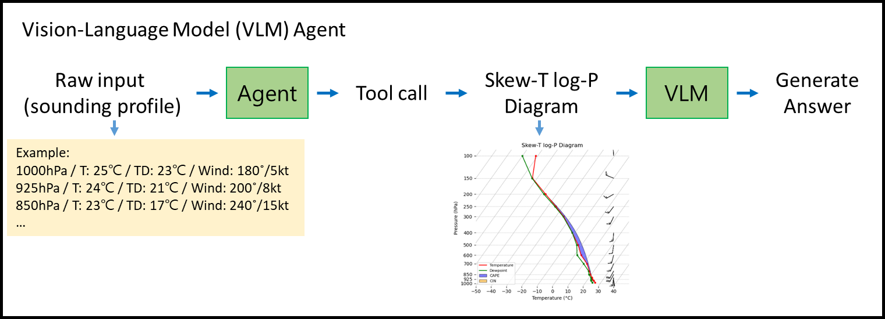
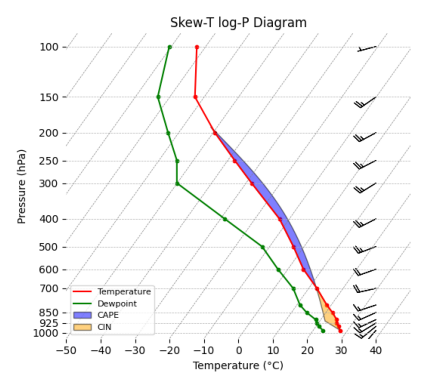
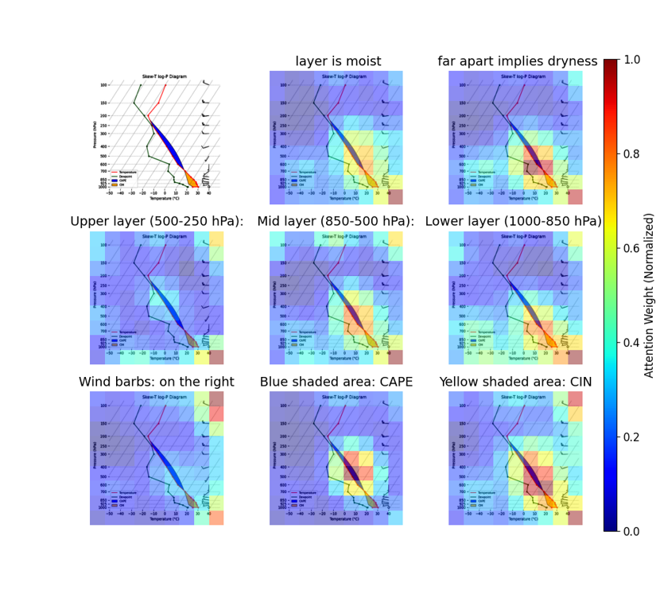

# A Vision-Language Model interpreting Skew-T

**Dataset**:  
Training and validation dataset is at https://osf.io/4n3uh/files/osfstorage

**Demo inference**:   
https://colab.research.google.com/github/hunter3789/VLM-Skew-T/blob/main/source/demo.ipynb
  
**Sample result**:  
"user": "Please describe the atmospheric profile based on the provided Skew-T log-P diagram. Reason carefully, and conclude with a precipitation probability category: Low, Moderate, High, or Very High.",  

  

"response": "A moderately sized blue-shaded region (CAPE) implies moderate instability, which may support thunderstorm development if lifting is present.  
The dense yellow layer (CIN) near the surface reflects significant inhibition, likely preventing convection unless strong forcing is present.  
The blue-shaded area starts high in the atmosphere, suggesting parcels face strong resistance to ascent and require substantial forcing to become buoyant.  
The CAPE area reaches into the upper levels, suggesting a storm environment with robust vertical development.  
The wide separation of red and green lines throughout the profile indicates a dry atmosphere with little cloud potential.  
Based on the analysis, the probability of precipitation is very high."  

**Self-attention map**:  

